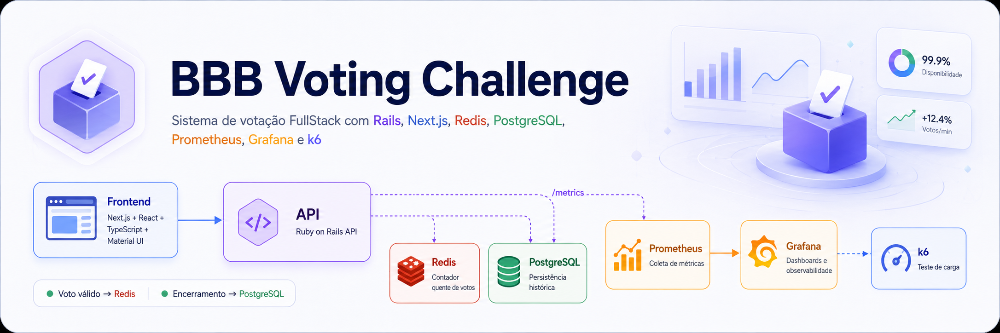

# BBB Voting Challenge

Sistema de votação inspirado no paredão do BBB, desenvolvido como desafio técnico FullStack.

A aplicação permite criar uma votação entre dois participantes, receber votos pela interface web e pela API, exibir o percentual atualizado em tempo real e monitorar a API com Prometheus e Grafana.

---

## Sumário

- [Visão geral](#visão-geral)
- [Screenshots](#screenshots)
- [Stack utilizada](#stack-utilizada)
- [Arquitetura](#arquitetura)
- [Funcionalidades](#funcionalidades)
- [Como subir o projeto](#como-subir-o-projeto)
- [URLs locais](#urls-locais)
- [Fluxo de uso](#fluxo-de-uso)
- [APIs](#apis)
- [Observabilidade](#observabilidade)
- [Dashboards Grafana](#dashboards-grafana)
- [Teste de carga](#teste-de-carga)
- [Testes automatizados](#testes-automatizados)
- [Cobertura de testes](#cobertura-de-testes)
- [SLO e SLI](#slo-e-sli)
- [Decisões técnicas](#decisões-técnicas)
- [Limitações conhecidas](#limitações-conhecidas)
- [Próximos passos](#próximos-passos)

---

## Visão geral

O objetivo do projeto é implementar um sistema de votação web para um paredão, onde usuários podem votar em um dos participantes disponíveis.

Após votar, o usuário recebe a confirmação do voto e visualiza o panorama percentual atualizado da votação.

Além da aplicação web, o projeto expõe uma API REST responsável por computar os votos, consultar totais gerais, totais por participante e votos por hora.

O projeto também inclui instrumentação da API, monitoramento com Prometheus, dashboards no Grafana e teste de carga com k6.

---

## Screenshots


### Página inicial

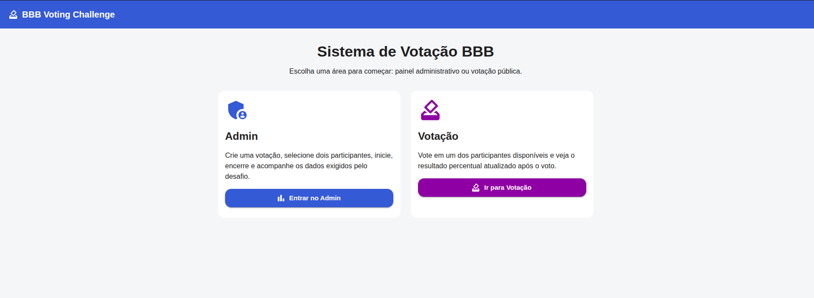

### Painel administrativo

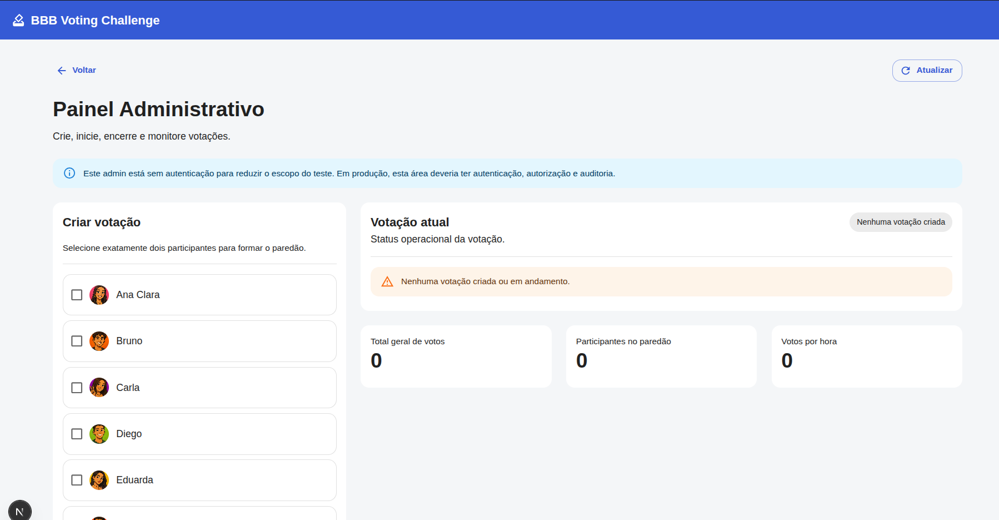

### Tela de votação

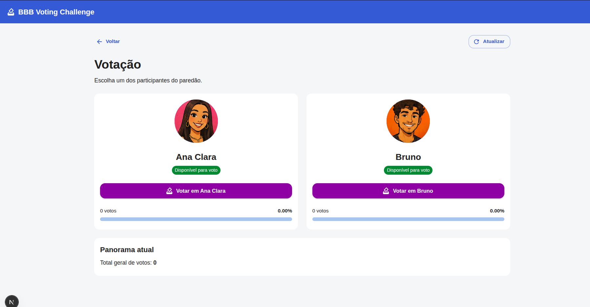

### Prometheus Targets

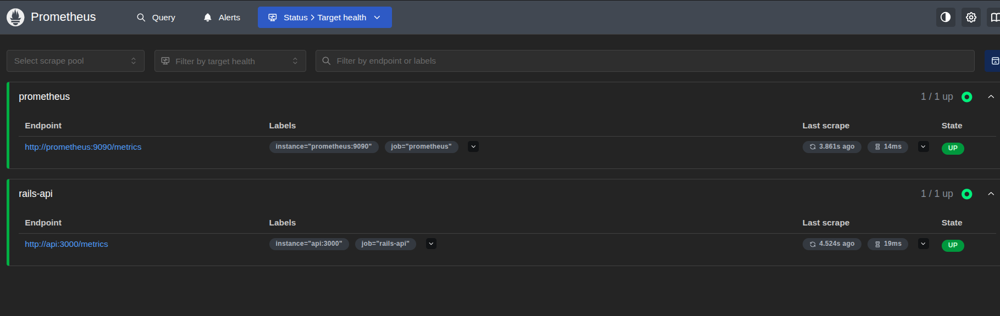

### Grafana — API Health

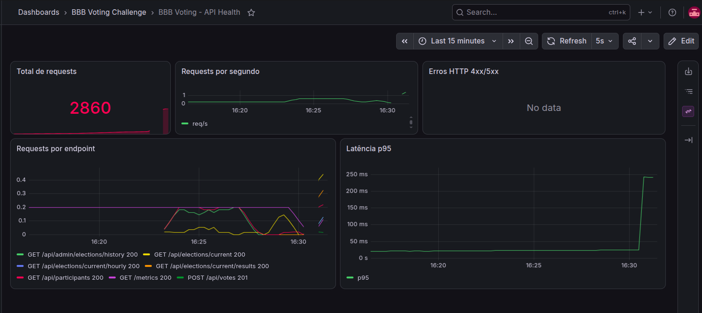

### Grafana — Business Metrics

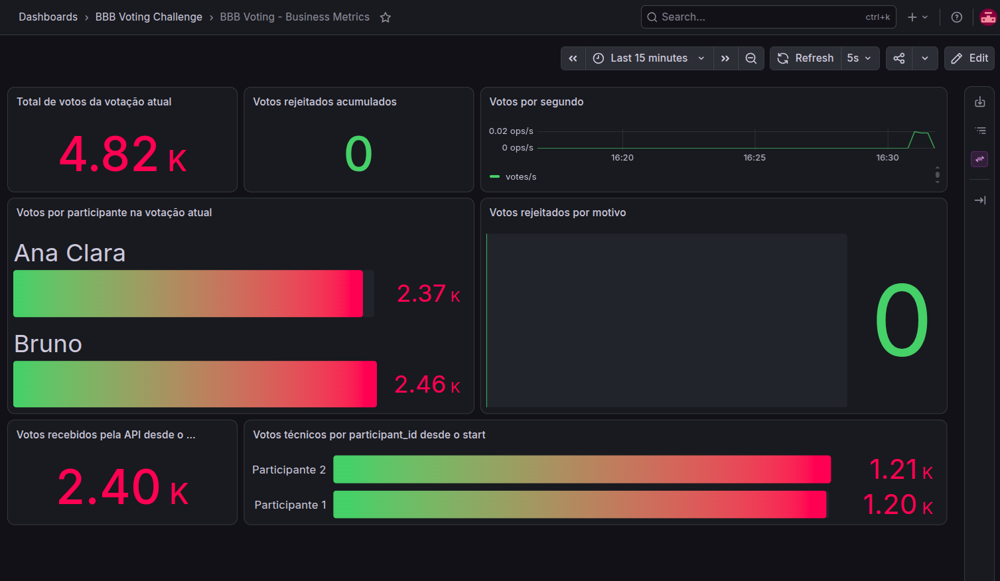

### Grafana — SLO / SLI

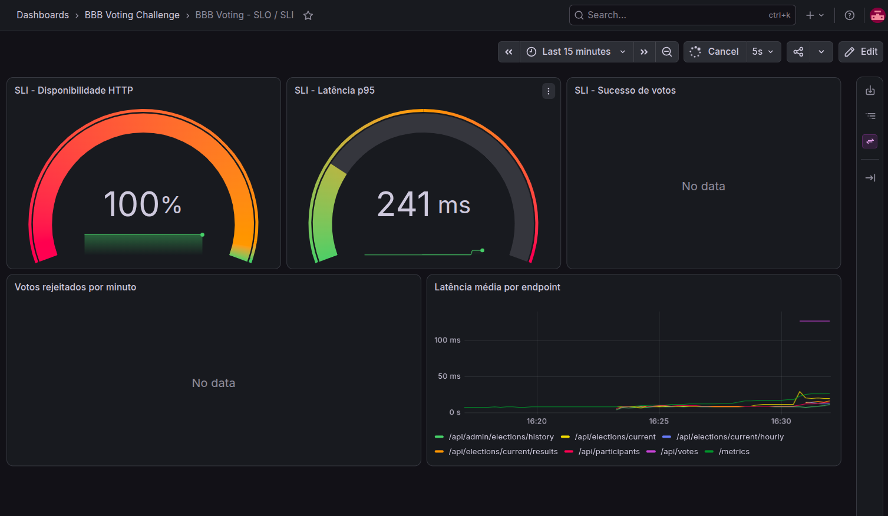

### Resultado do teste de carga k6

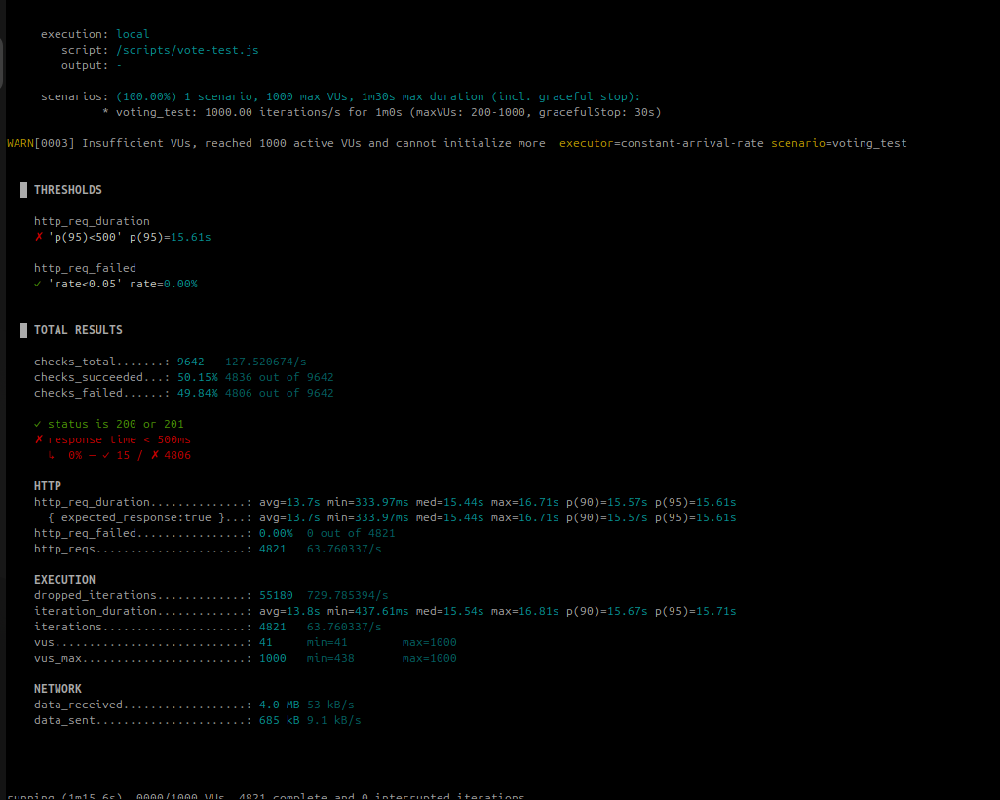

---

## Stack utilizada

### Backend

- Ruby on Rails API
- PostgreSQL
- Redis
- Puma
- Prometheus Client
- RSpec

### Frontend

- Next.js
- React
- TypeScript
- Material UI
- Jest
- Testing Library

### Infra / Observabilidade

- Docker
- Docker Compose
- Prometheus
- Grafana
- k6

---

## Arquitetura

A aplicação é composta pelos seguintes serviços:

```txt
Frontend Next.js
        |
        v
Rails API
   |        |
   |        v
   |      Redis
   |        |
   v        v
PostgreSQL  Prometheus
              |
              v
            Grafana
```

### Diagrama de arquitetura

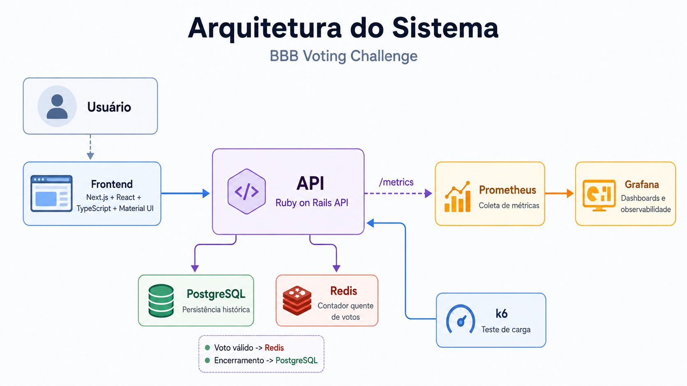

### Serviços no Docker Compose

```txt
api          Rails API
frontend     Interface web Next.js
postgres     Banco relacional
redis        Contador quente de votos
prometheus   Coleta de métricas da API
grafana      Dashboards de monitoração
k6           Teste de carga
```

---

## Funcionalidades

### Área pública de votação

- Exibe a votação ativa.
- Lista os dois participantes disponíveis.
- Permite votar em um dos participantes.
- Exibe confirmação de voto.
- Exibe total geral e percentual por participante.

### Área administrativa

- Lista os 12 participantes disponíveis.
- Permite criar uma votação escolhendo exatamente 2 participantes.
- Permite iniciar votação.
- Permite encerrar votação.
- Exibe total geral de votos.
- Exibe votos por participante.
- Exibe votos por hora.
- Exibe histórico de votações encerradas.

### Observabilidade

- Endpoint `/metrics` exposto pela API.
- Métricas HTTP por rota, método e status.
- Métricas de votos aceitos.
- Métricas de votos rejeitados.
- Métricas da votação atual.
- Dashboards Grafana provisionados automaticamente.

---

## Como subir o projeto

### Pré-requisitos

- Docker
- Docker Compose
- Make
- jq

O `jq` é usado pelos comandos do Makefile que criam uma votação automaticamente para o teste de carga.

No Ubuntu/Debian:

```bash
sudo apt-get install jq
```

No macOS:

```bash
brew install jq
```

---

## Subir todos os serviços

Na raiz do projeto:

```bash
make up-detached
```

Ou:

```bash
docker compose up --build -d
```

---

## Preparar banco de dados

```bash
make db-prepare
make db-seed
```

Ou, para resetar tudo:

```bash
make db-reset
```

O seed cria 12 participantes iniciais.

---

## URLs locais

| Serviço | URL |
|---|---|
| Frontend | http://localhost:3000 |
| Rails API | http://localhost:3001 |
| Healthcheck | http://localhost:3001/health |
| Metrics | http://localhost:3001/metrics |
| Prometheus | http://localhost:9090 |
| Grafana | http://localhost:3002 |

Credenciais do Grafana:

```txt
Usuário: admin
Senha: admin
```

---

## Fluxo de uso

### Pela interface web

1. Acesse:

```txt
http://localhost:3000
```

2. Clique em **Admin**.
3. Selecione 2 participantes.
4. Clique em **Criar votação**.
5. Clique em **Iniciar votação**.
6. Volte para a tela inicial.
7. Clique em **Votação**.
8. Vote em um dos participantes.
9. Veja o resultado atualizado.

---

## APIs

Base URL local:

```txt
http://localhost:3001
```

---

### Healthcheck

```http
GET /health
```

Resposta esperada:

```json
{
  "status": "ok"
}
```

---

### Listar participantes

```http
GET /api/participants
```

Resposta:

```json
[
  {
    "id": 1,
    "name": "Ana Clara",
    "avatar_url": "/participants/1.png",
    "active": true
  }
]
```

---

### Consultar votação atual

```http
GET /api/elections/current
```

Resposta quando existe votação:

```json
{
  "id": 1,
  "status": "running",
  "started_at": "2026-07-07T10:00:00Z",
  "ended_at": null,
  "participants": [
    {
      "id": 1,
      "name": "Ana Clara",
      "avatar_url": "/participants/1.png",
      "active": true
    },
    {
      "id": 2,
      "name": "Bruno",
      "avatar_url": "/participants/2.png",
      "active": true
    }
  ]
}
```

Resposta quando não existe votação:

```json
null
```

---

### Criar votação

```http
POST /api/admin/elections
```

Payload:

```json
{
  "participant_ids": [1, 2]
}
```

Resposta:

```json
{
  "id": 1,
  "status": "draft",
  "started_at": null,
  "ended_at": null,
  "participants": [
    {
      "id": 1,
      "name": "Ana Clara"
    },
    {
      "id": 2,
      "name": "Bruno"
    }
  ]
}
```

---

### Iniciar votação

```http
POST /api/admin/elections/:id/start
```

Exemplo:

```bash
curl -X POST http://localhost:3001/api/admin/elections/1/start
```

---

### Encerrar votação

```http
POST /api/admin/elections/:id/close
```

Ao encerrar a votação:

- Os votos finais são persistidos no PostgreSQL.
- Os snapshots por hora são persistidos.
- A votação muda para `closed`.
- As chaves Redis da votação são limpas.
- As métricas da votação atual passam a ser zeradas no próximo scrape.

---

### Votar

```http
POST /api/votes
```

Payload:

```json
{
  "participant_id": 1
}
```

Resposta:

```json
{
  "election_id": 1,
  "status": "running",
  "total_votes": 100,
  "candidates": [
    {
      "participant_id": 1,
      "name": "Ana Clara",
      "votes": 60,
      "percentage": 60.0
    },
    {
      "participant_id": 2,
      "name": "Bruno",
      "votes": 40,
      "percentage": 40.0
    }
  ]
}
```

---

### Consultar resultados da votação atual

```http
GET /api/elections/current/results
```

Retorna:

- ID da votação.
- Status.
- Total geral de votos.
- Votos por participante.
- Percentual por participante.

---

### Consultar votos por hora

```http
GET /api/elections/current/hourly
```

Resposta:

```json
{
  "election_id": 1,
  "hours": [
    {
      "hour": "2026-07-07T14:00:00Z",
      "total_votes": 500
    }
  ]
}
```

---

### Histórico de votações

```http
GET /api/admin/elections/history
```

Retorna votações encerradas com total final e votos por participante.

---

## Observabilidade

A API expõe métricas Prometheus em:

```txt
http://localhost:3001/metrics
```

Principais métricas:

```txt
http_requests_total
http_request_duration_seconds_bucket
http_request_duration_seconds_sum
http_request_duration_seconds_count

votes_total
votes_rejected_total

current_election_total_votes
current_election_participant_votes
current_election_participant_active
```

### Métricas HTTP

```txt
http_requests_total
```

Labels:

```txt
method
path
status
```

Exemplo:

```promql
sum by (method, path, status) (rate(http_requests_total[1m]))
```

### Latência

```txt
http_request_duration_seconds_bucket
```

Exemplo p95:

```promql
histogram_quantile(
  0.95,
  sum(rate(http_request_duration_seconds_bucket[5m])) by (le)
)
```

### Votos

```txt
votes_total
```

Representa os votos recebidos pela API desde que o processo subiu.

### Votos rejeitados

```txt
votes_rejected_total
```

Representa votos rejeitados por motivo, por exemplo:

```txt
no_running_election
invalid_participant
```

### Votação atual

```txt
current_election_total_votes
current_election_participant_votes
current_election_participant_active
```

Essas métricas representam o placar atual da votação em andamento.

---

## Dashboards Grafana

O Grafana já sobe provisionado automaticamente com datasource Prometheus e dashboards.

Acesse:

```txt
http://localhost:3002
```

Login:

```txt
admin / admin
```

Dashboards disponíveis:

```txt
BBB Voting - API Health
BBB Voting - Business Metrics
BBB Voting - SLO / SLI
```

### Dashboard 1 — API Health

Métricas principais:

- Total de requests.
- Requests por segundo.
- Requests por endpoint.
- Erros HTTP 4xx/5xx.
- Latência p95.

### Dashboard 2 — Business Metrics

Métricas principais:

- Total de votos da votação atual.
- Votos por participante da votação atual.
- Votos por segundo.
- Votos rejeitados acumulados.
- Votos rejeitados por motivo.
- Votos recebidos pela API desde o start.

### Dashboard 3 — SLO / SLI

Métricas principais:

- Disponibilidade HTTP.
- Latência p95.
- Sucesso de votos.
- Votos rejeitados por minuto.

---

## Teste de carga

O projeto usa k6 para teste de carga.

O script fica em:

```txt
load-tests/vote-test.js
```

---

### Preparar votação para load test

O Makefile possui um comando que:

- Verifica se já existe uma votação running.
- Se existir, reutiliza.
- Se existir uma votação draft, inicia.
- Se não existir votação, cria uma com os participantes definidos em `LOAD_TEST_PARTICIPANTS`.

```bash
make prepare-load-election
```

Por padrão:

```txt
LOAD_TEST_PARTICIPANTS=[1,2]
```

Para escolher outros participantes:

```bash
make prepare-load-election LOAD_TEST_PARTICIPANTS=[3,4]
```

---

### Rodar teste de carga

Teste padrão:

```bash
make load-test
```

Esse comando usa:

```txt
LOAD_TEST_RATE=100
LOAD_TEST_DURATION=1m
LOAD_TEST_PRE_ALLOCATED_VUS=50
LOAD_TEST_MAX_VUS=300
```

---

### Rodar teste com 100 req/s

```bash
make load-test-100
```

Ou manualmente:

```bash
make load-test LOAD_TEST_RATE=100 LOAD_TEST_DURATION=1m
```

---

### Rodar teste com 1000 req/s

```bash
make load-test-1000
```

Ou manualmente:

```bash
make load-test \
  LOAD_TEST_RATE=1000 \
  LOAD_TEST_DURATION=1m \
  LOAD_TEST_PRE_ALLOCATED_VUS=300 \
  LOAD_TEST_MAX_VUS=1500
```

Observação: o resultado do teste de 1000 req/s depende da máquina local, da quantidade de CPU/memória disponível para Docker e da configuração do Puma/Rails.

---

### Interpretando resultado do k6

Principais métricas:

```txt
http_reqs
http_req_duration
http_req_failed
checks_succeeded
checks_failed
dropped_iterations
```

Thresholds configurados:

```txt
http_req_failed < 5%
p95 < 500ms
```

Se `dropped_iterations` aparecer alto, a máquina local não conseguiu gerar/manter a taxa configurada.

Se `http_req_failed` aparecer alto, verificar:

- Existe votação ativa?
- Os participantes do teste fazem parte da votação?
- A API está respondendo?
- O Redis está disponível?
- A URL interna do k6 está correta?

---

## Testes automatizados

### Backend

Rodar testes da API:

```bash
make test-api
```

Ou:

```bash
docker compose exec api bundle exec rspec
```

### Frontend

Rodar testes do frontend:

```bash
make test-front
```

Ou:

```bash
docker compose exec frontend npm test
```

### Cobertura frontend

```bash
make test-front-coverage
```

Ou:

```bash
docker compose exec frontend npm run test:coverage
```

### Rodar tudo

```bash
make test-all
```

---

## Cobertura de testes

Preencher antes da entrega final.

### Backend

```txt
RSpec coverage: 90.16%
Branches: 88.46%
```

### Frontend

```txt
Statements: 95.16%
Branches: 85.71%
Functions: 95.83%
Lines: 95.16%
```

### Evidências

Resumo dos relatórios:

```txt
api/coverage/index.html
frontend/coverage/lcov-report/index.html
```


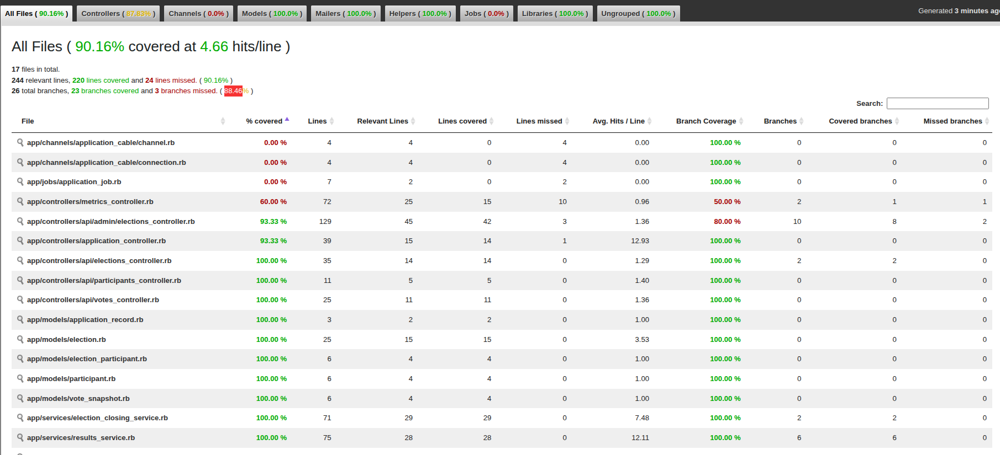

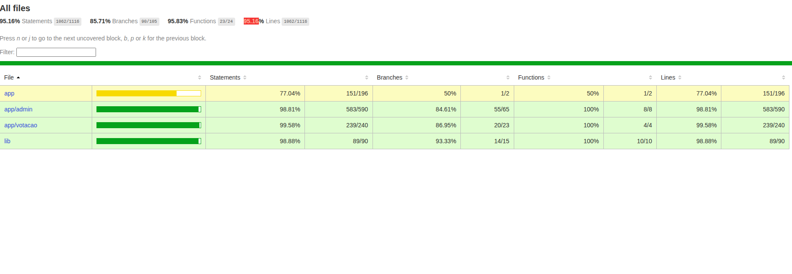


---

## SLO e SLI

### SLO 1 — Disponibilidade HTTP

Objetivo:

```txt
99% das requisições HTTP devem responder sem erro 5xx em janela de 5 minutos.
```

SLI:

```promql
100 * (
  sum(rate(http_requests_total{status!~"5.."}[5m]))
  /
  sum(rate(http_requests_total[5m]))
)
```

---

### SLO 2 — Latência

Objetivo:

```txt
95% das requisições devem responder em até 500ms.
```

SLI:

```promql
histogram_quantile(
  0.95,
  sum(rate(http_request_duration_seconds_bucket[5m])) by (le)
)
```

---

### SLO 3 — Sucesso de votos

Objetivo:

```txt
99% das tentativas de voto válidas devem ser computadas com sucesso.
```

SLI:

```promql
100 * (
  sum(rate(votes_total[5m]))
  /
  (
    sum(rate(votes_total[5m]))
    +
    sum(rate(votes_rejected_total[5m]))
  )
)
```

---

## Decisões técnicas

### Redis como contador quente

A votação pode receber alto volume de votos. Por isso, o caminho crítico do voto usa Redis para incrementar contadores de forma rápida.

O fluxo principal é:

```txt
POST /api/votes
  -> valida votação ativa
  -> valida participante
  -> incrementa Redis
  -> incrementa métricas
  -> retorna resultado atualizado
```

Isso evita que cada voto dependa diretamente de um update relacional no PostgreSQL.

---

### PostgreSQL como persistência histórica

O PostgreSQL é usado para armazenar:

- Participantes.
- Votações.
- Participantes por votação.
- Resultado final.
- Snapshots por hora.
- Histórico de votações encerradas.

Ao encerrar uma votação, os dados finais são persistidos no banco.

---

### API stateless

A API Rails é stateless em relação ao processo web. Os contadores ficam no Redis e os dados persistidos ficam no PostgreSQL.

Isso facilita escalar horizontalmente a API.

---

### Métricas separadas entre técnica e negócio

O projeto diferencia:

```txt
votes_total
```

Métrica técnica de votos recebidos pela API desde o start do processo.

```txt
current_election_total_votes
current_election_participant_votes
```

Métricas de negócio representando o placar atual da votação ativa.

---

### Admin sem autenticação

O painel administrativo está sem autenticação para reduzir o escopo do desafio.

Em produção, essa área deveria ter:

- Autenticação.
- Autorização.
- Auditoria.
- Proteção contra CSRF, se aplicável.
- Logs de ações administrativas.

---

## Limitações conhecidas

- O admin não possui autenticação.
- O anti-bot é simplificado.
- Os counters Prometheus em memória zeram quando o processo Rails reinicia.
- O teste de 1000 req/s depende dos recursos da máquina local.
- O ambiente Kubernetes foi considerado como evolução, mas a entrega principal usa Docker Compose.
- O Redis é usado como contador quente; persistência final ocorre ao encerrar votação.
- Em caso de falha abrupta antes do encerramento, seria necessário um job periódico de snapshot para aumentar resiliência.

---

## Próximos passos

Melhorias possíveis:

- Adicionar autenticação no admin.
- Adicionar rate limit por IP.
- Adicionar captcha ou mecanismo anti-bot.
- Criar job periódico para persistir snapshots do Redis no PostgreSQL.
- Adicionar Redis Exporter.
- Adicionar PostgreSQL Exporter.
- Criar manifests Kubernetes.
- Adicionar HPA baseado em CPU ou métricas customizadas.
- Adicionar pipeline CI/CD.
- Adicionar logs estruturados com correlação por request ID.
- Adicionar tracing distribuído.
- Adicionar OpenTelemetry.

---

## Comandos úteis

Subir tudo:

```bash
make up-detached
```

Derrubar:

```bash
make down
```

Derrubar e remover volumes:

```bash
make down-volumes
```

Logs da API:

```bash
make logs-api
```

Logs do frontend:

```bash
make logs-front
```

Preparar banco:

```bash
make db-prepare
```

Seed:

```bash
make db-seed
```

Resetar banco:

```bash
make db-reset
```

Rodar teste de carga:

```bash
make load-test
```

Rodar teste de carga com 1000 req/s:

```bash
make load-test-1000
```

Rodar testes backend:

```bash
make test-api
```

Rodar testes frontend:

```bash
make test-front
```

Abrir console Rails:

```bash
make rails-console
```

---

## Estrutura do projeto

```txt
.
├── api/
│   ├── app/
│   ├── config/
│   ├── db/
│   └── spec/
├── frontend/
│   ├── public/
│   ├── src/
│   └── tests/
├── docs/
│   └── images/
│       ├── home.png
│       ├── admin.png
│       ├── voting.png
│       ├── architecture.png
│       ├── prometheus-targets.png
│       ├── grafana-api-health.png
│       ├── grafana-business.png
│       ├── grafana-slo-sli.png
│       └── k6-load-test.png
├── load-tests/
│   └── vote-test.js
├── monitoring/
│   ├── prometheus/
│   │   └── prometheus.yml
│   └── grafana/
│       ├── provisioning/
│       │   ├── datasources/
│       │   └── dashboards/
│       └── dashboards/
├── docker-compose.yml
├── Makefile
└── README.md
```